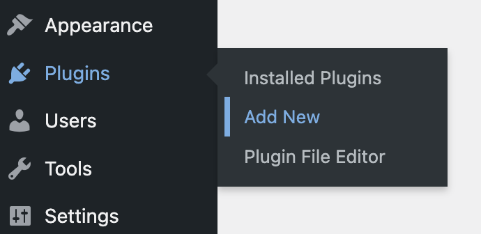
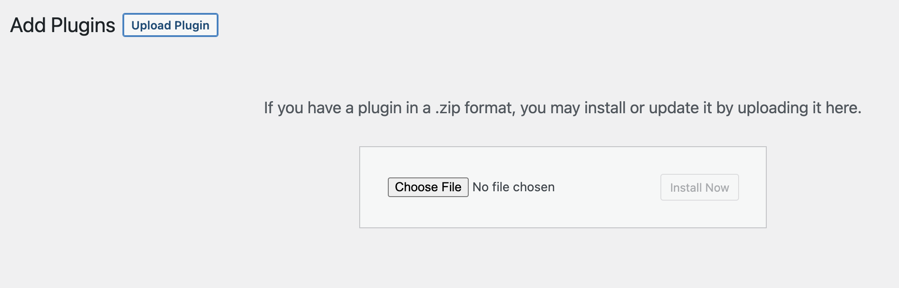
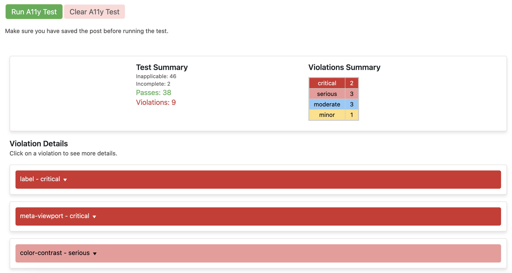

# A11y Tester WordPress Plugin

[a SoCalTechLab.com project](https://socaltechlab.com/)

-   📣 Plugin Name: A11y Tester
-   ✨ Description: Test accessibility of your WordPress pages and posts right from the admin dashboard!
-   📝 Latest Release: [Latest](https://github.com/skullzarmy/a11y-tester-wordpress-plugin/releases/latest)
-   👤 Original Author: Joe Peterson
-   👥 Contributors: ([your name here!](./CONTRIBUTING.md))
-   🔗 Author URI: https://joepeterson.work
-   📑 License: [GPLv3 License](./LICENSE)

## 🎯 Goal

The A11y Tester WordPress plugin aims to make accessibility testing seamless and integrated into the WordPress ecosystem. Utilizing the power of the axe-core library, this plugin enables you to conduct accessibility tests on your WordPress pages and posts directly from the admin dashboard. Ensure your content is accessible to all, including those using assistive technologies, with just the click of a button.

## 🚀 Installation

### From WordPress Plugin Repository (Not yet available)

1. ~~Go to 'Plugins' > 'Add New' in your WordPress dashboard.~~
1. ~~Search for 'A11y Tester'.~~
1. ~~Click 'Install Now' and then 'Activate'.~~

### Manual Installation

1. Download the [latest release](https://github.com/skullzarmy/a11y-tester-wordpress-plugin/releases/latest) .zip.
1. Install the plugin through the WordPress plugins screen directly.
    1. 
    1. 
1. Activate the plugin through the 'Plugins' screen in WordPress.

## 🛠 Usage

1. Edit Post/Page: Navigate to the post or page you want to test.
1. Find A11y Tester Meta Box: Scroll down to find the 'A11y Tester' meta box.
1. Run Test: Click the 'Run A11y Test' button to start the accessibility test.
1. View Results: The test results will be displayed within the meta box. Issues are categorized by impact severity.
1. Clear Results: Click 'Clear A11y Test' to remove the results.

## 🖌 Customization

The plugin comes with a predefined set of CSS styles to make the results readable and organized. You can customize the styles by editing the a11y-styles.css file.

## 📜 License

This WordPress Plugin is free software: you can redistribute it and/or modify it under the terms of the GNU General Public License as published by the Free Software Foundation, either version 2 of the License or any later version.

This program is distributed in the hope that it will be useful, but WITHOUT ANY WARRANTY; without even the implied warranty of MERCHANTABILITY or FITNESS FOR A PARTICULAR PURPOSE. See [the License file](./LICENSE) for more details.

## 👏 Contributions

-   Contributions, issues, and feature requests are **welcome!** Feel free to check the [issues](https://github.com/skullzarmy/a11y-tester-wordpress-plugin/issues) page.
-   Please read [the contributing guidelines](./CONTRIBUTING.md) as well as the [Code of Conduct](./CODE_OF_CONDUCT.md) prior to contributing.

## 📞 Support

For support, visit the [A11y Tester WordPress plugin GitHub repository](https://github.com/skullzarmy/a11y-tester-wordpress-plugin) and [submit an issue](https://github.com/skullzarmy/a11y-tester-wordpress-plugin/issues).
