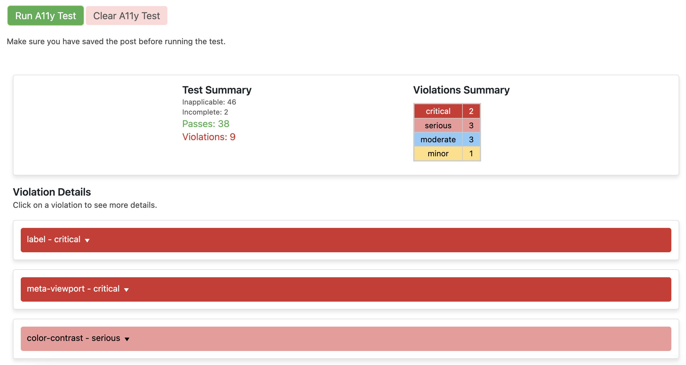

# A11y Tester WordPress Plugin

[](https://socaltechlab.com/?rel=a11yGitHubRepo)

[a SoCalTechLab.com project](https://socaltechlab.com/utils/a11y-tester-wordpress-plugin/?rel=a11yGitHubRepo)

-   📣 Plugin Name: A11y Tester
-   ✨ Description: Test accessibility of your WordPress pages and posts right from the admin dashboard!
-   📝 Latest Release: [Latest](https://github.com/skullzarmy/a11y-tester-wordpress-plugin/releases/latest)
-   👤 Original Author: Joe Peterson
-   👥 Contributors: ([your name here!](./CONTRIBUTING.md))
-   🔗 Author URI: [https://joepeterson.work](https://joepeterson.work/?rel=a11yGitHubRepo)
-   📑 License: [GPLv3 License](./LICENSE)

## 🎯 Goal

The A11y Tester WordPress plugin aims to make accessibility testing seamless and integrated into the WordPress ecosystem. Utilizing the power of the axe-core library, this plugin enables you to conduct accessibility tests on your WordPress pages and posts directly from the admin dashboard. Ensure your content is accessible to all, including those using assistive technologies, with just the click of a button.

## 🚀 Installation

### From WordPress Plugin Repository (Not yet available)

1. ~~Go to 'Plugins' > 'Add New' in your WordPress dashboard.~~
1. ~~Search for 'A11y Tester'.~~
1. ~~Click 'Install Now' and then 'Activate'.~~

### Manual Installation

1. Download the [latest release](https://github.com/skullzarmy/a11y-tester-wordpress-plugin/releases/latest) .zip.
1. Install the plugin through the WordPress plugins screen directly.
    1. 
    1. 
1. Activate the plugin through the 'Plugins' screen in WordPress.

## 🛠 Usage



1. Edit Post/Page: Navigate to the post or page you want to test.
1. Find A11y Tester Meta Box: Scroll down to find the 'A11y Tester' meta box.
1. Run Test: Click the 'Run A11y Test' button to start the accessibility test.
1. View Results: The test results will be displayed within the meta box. Issues are categorized by impact severity.
1. Clear Results: Click 'Clear A11y Test' to remove the results.

## ⚙️ Under the Hood

The A11y Tester WordPress plugin utilizes the robust [axe-core](https://github.com/dequelabs/axe-core) library to conduct accessibility testing on your WordPress pages and posts.

### 🤔 What is Axe-Core?

Axe-core is an industry standard for web accessibility, providing automated accessibility testing to ensure your web content is compliant with Web Content Accessibility Guidelines (WCAG). The library produces a detailed report of accessibility issues, categorized by their level of impact, which aids in prioritizing areas for improvement.

### 🏃‍♀️ How Does It Work?

Starting from version 1.0.6, the plugin creates a scoped iframe to securely run the accessibility tests. When you click the 'Run A11y Test' button in the A11y Tester meta box on your WordPress admin dashboard, an AJAX request is sent to the server to retrieve the permalink. The plugin then uses axe-core to perform an accessibility scan on the full URL of the selected page or post within a scoped iframe. The server processes the scan and returns the results, which are displayed directly within the A11y Tester meta box, sorted by impact level for your convenience.

### 🛠️ Future Plans for Customization

As of the current release, the plugin does not allow customization of axe-core's run parameters. However, we are planning to introduce this feature in upcoming versions to offer a more tailored accessibility testing experience.

## 🖌 Customization

### Overriding Plugin Styles

To allow for more flexible styling customization, the plugin supports the ability to override the default styles. You can do this by placing a cloned version of the `a11y-styles.css` file in your active theme folder, inside a sub-folder named `a11y-tester`.

For example, the structure should be as follows:

```plaintext
- wp-content
    - themes
        - your-active-theme
            - a11y-tester
                - a11y-styles.css
```

When this file is detected in the active theme folder, the plugin will automatically enqueue this style sheet in place of the default one, allowing you to customize the styles as you see fit.

If the file is not found in the active theme folder, the plugin will fall back to using the default styles located in the plugin directory.

To implement this, make sure to update your CSS and keep it in sync with the `a11y-styles.css` file in the `a11y-tester` folder of your active theme.

## 📜 License

This WordPress Plugin is free software: you can redistribute it and/or modify it under the terms of the GNU General Public License as published by the Free Software Foundation, either version 2 of the License or any later version.

This program is distributed in the hope that it will be useful, but WITHOUT ANY WARRANTY; without even the implied warranty of MERCHANTABILITY or FITNESS FOR A PARTICULAR PURPOSE. See [the License file](./LICENSE) for more details.

## 👏 Contributions

-   Contributions, issues, and feature requests are **welcome!** Feel free to check the [issues](https://github.com/skullzarmy/a11y-tester-wordpress-plugin/issues) page.
-   Please read [the contributing guidelines](./CONTRIBUTING.md) as well as the [Code of Conduct](./CODE_OF_CONDUCT.md) prior to contributing.

## 📞 Support

For support, visit the [A11y Tester WordPress plugin GitHub repository](https://github.com/skullzarmy/a11y-tester-wordpress-plugin) and [submit an issue](https://github.com/skullzarmy/a11y-tester-wordpress-plugin/issues).
